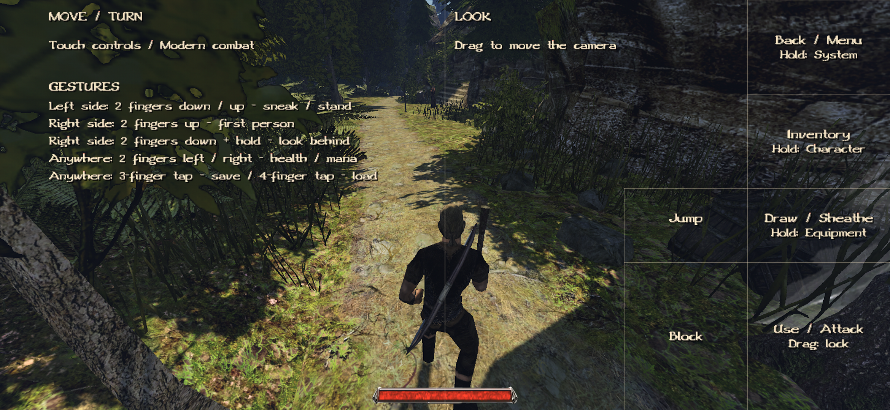

# Touch controls

Touch controls are invisible during normal play. Hold **Back/menu**, drag lower-right and release to toggle the debug layout.
You can also set `Gothic.ini` `[DEBUG] touchControls=1` to show it, or `0` to hide it.
See [editing settings](CONFIGURATION.md#editing-settings).

A connected, enabled gamepad takes over gameplay input; the Android keyboard remains available.
Set `Gamepad.ini` `[Controller] Enabled=0` to use touch while it is connected.

## Layout

- **Left half:** touch anywhere to place the movement stick. Forward/back moves; sideways turns the character. Small input walks/turns gently, a firmer drag runs.
- **Middle-right:** drag to look around. Mouse speed controls camera sensitivity.
- **Right edge:** buttons arranged from top to bottom:

| Screen height | Action |
| --- | --- |
| Top 20% | Back/menu |
| 20–40% | Inventory |
| 40–55% | Jump |
| 55–70% | Draw/sheathe |
| Bottom 30% | Use/attack or menu accept |

Buttons occupy the rightmost 16% of the screen; Use/Attack extends to the rightmost 24%.
In Gothic II melee controls, **Block** sits left of Draw, above Use/Attack.
You can move and look with separate fingers.

## Combat and target lock

**Gothic II controls** (`[GAME] useGothic1Controls=0`): tap Use/Attack to strike and Block for one timed parry.
With no focused melee target, a short Attack tap swings on release; a hold does nothing.
Holding Block does not repeat parries.

With a bow or crossbow drawn, tap Use/Attack for one shot after aiming finishes; hold for repeat fire.
This works with either combat setting.

**Classic controls** (`useGothic1Controls=1`): hold Use/Attack, then push the left stick:
up attacks forward, left/right attacks sideways, and a deliberate straight-down pull blocks.
Return to neutral between attacks. Slight downward diagonals do not block.

To finish an unconscious NPC, focus them at close range with a one- or two-handed weapon drawn.
Use Attack in Gothic II controls; in classic controls, hold Attack and push forward. Fists cannot finish.

With a weapon drawn, press Attack and quickly drag that finger to toggle target lock.
Repeat the gesture to unlock. While locked, sideways movement strafes and vertical camera look still works.
Release classic Attack to move rather than request directional attacks.
Focus range is not attack reach or guaranteed safety; see [targeting settings](CONTROLLER.md#movement-and-targeting-settings).

## Radial menus

- Hold **Draw** to open equipment selection.
- Hold **Inventory** for Stats (up) / Journal (down).
- Hold **Back/menu** for FPS (up), touch-debug overlay (lower-right), or Classic/Centered HUD (lower-left). Choices are saved; Classic HUD is the default.
- Keep the same finger down, drag a little toward a choice, then release to apply.
- Release without selecting, or return to the finger's starting point, to cancel.

The wheel is drawn in the screen center, but selection is relative to your finger's position when it opened.
You do not need to reach the wheel. Equipment pages show usable owned weapons and assigned spells.
For more pages, hold toward Previous/Next, return near the starting point, then select.
The world keeps running; other touch controls are suspended until the wheel closes.

## Multi-finger gestures

| Gesture | Action |
| --- | --- |
| Two fingers on the left: down / up | Sneak / stand |
| Two fingers on the right: up | First person |
| Two fingers on the right: down and hold | Look behind until released |
| Two fingers anywhere: left / right | Health / mana potion |
| Three-finger tap anywhere | Quicksave |
| Four-finger tap anywhere | Quickload immediately, without confirmation |

Put fingers down within about 350 ms before lifting any. Swipe together in one clear direction.
For three/four-finger taps, keep them nearly still and lift all within 800 ms.
Shortcuts require [useQuickSaveKeys/usePotionKeys](CONFIGURATION.md#shortcuts-audio-and-other-preferences);
sneak requires the learned skill.

## Menus and saves

Saving and quicksaving are disabled while dead, so they cannot overwrite a slot with a dead character.

Drag on either stick area: up/down selects, right accepts, left goes back.
Sliders still adjust left/right; inventory grids use all directions for item selection.
Use/Attack accepts; Back closes one level, including journal descriptions.
Release the movement finger before resuming gameplay.

Save-name entry opens the Android keyboard; press **Done** to accept.
In save/load menus, select a slot and use a three-finger tap to request deletion.
Use/Attack confirms permanent deletion; Back cancels. There is no undo.

## Swimming

Movement follows the camera underwater. Hold Jump at the surface to dive.
Release and hold Jump again underwater to rise; release to return to camera-directed swimming.
Center movement to stop. Release Jump before diving again after surfacing.
